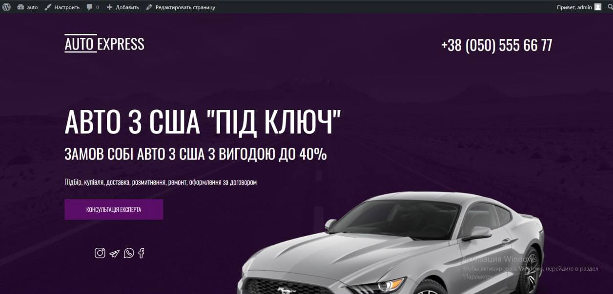

# AutoExpress

Welcome to AutoExpress, a dynamic car sales platform designed to streamline the browsing and purchasing process for both buyers and sellers. Built on WordPress, AutoExpress offers an intuitive,
feature-rich environment with a custom, responsive design tailored for the automotive industry.

## Features

- **Responsive Layout:** Crafted for optimal viewing on any device.
- **WordPress CMS Integration:** Easy content management for car listings.
- **Advanced Search Functionality:** Filters for make, model, year, and more to help users find their perfect vehicle.
- **User Dashboard:** For managing listings, profiles, and preferences.
- **Contact Forms:** Direct communication between buyers and sellers.

## Getting Started

### Prerequisites

- WordPress 5.x
- PHP 7.4 
- MySQL 5.6 

### Installation

1. Clone the repository to your WordPress themes directory:
git clone https://github.com/Vzhukovskaya/AutoExpress
2. Activate the theme through the WordPress admin dashboard.
3. Configure the theme settings as per your requirements.

## Usage

After installation, log in to your WordPress dashboard to start adding car listings.
Navigate to `AutoExpress Options` to customize the theme settings, including colors, layout options, and more.

## Demo

Here's a quick look at what AutoExpress has to offer:

### Screenshot

### Video Demo

Watch a full demo of AutoExpress in action on Vimeo: [Watch the Demo](https://vimeo.com/908848663?share=copy)

## Contributing

We welcome contributions! 
If you'd like to improve AutoExpress, please fork the repository and submit a pull request.

## Contact

For support or any questions:
- Email: valeriazhukovskaya789@gmail.com
- GitHub Issues: [Submit an Issue](https://github.com/Vzhukovskaya/AutoExpress/)
